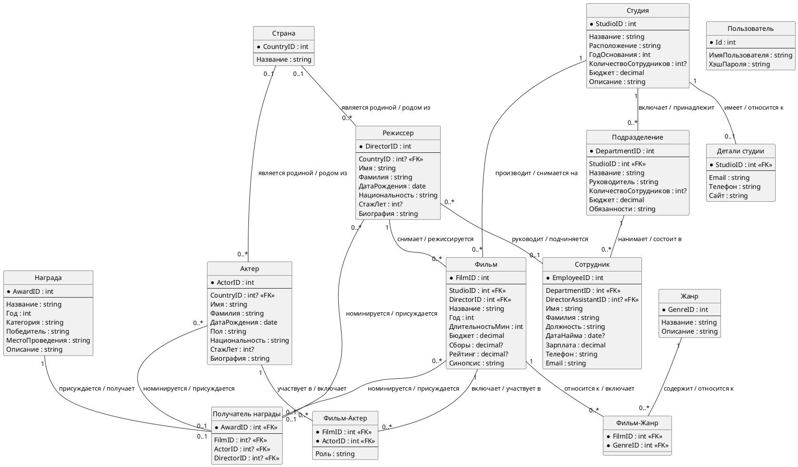

# MovieStudioWebApplication

ER диаграмма (PlantUML)

```plantuml
@startuml
hide circle

entity "Студия" as Studio {
  *StudioID : int
  --
  Название : string
  Расположение : string
  ГодОснования : int
  КоличествоСотрудников : int?
  Бюджет : decimal
  Описание : string
}

entity "Детали студии" as StudioDetails {
  *StudioID : int <<FK>>
  --
  Email : string
  Телефон : string
  Сайт : string
}

entity "Подразделение" as Department {
  *DepartmentID : int
  --
  StudioID : int <<FK>>
  Название : string
  Руководитель : string
  КоличествоСотрудников : int?
  Бюджет : decimal
  Обязанности : string
}

entity "Сотрудник" as Employee {
  *EmployeeID : int
  --
  DepartmentID : int <<FK>>
  DirectorAssistantID : int? <<FK>>
  Имя : string
  Фамилия : string
  Должность : string
  ДатаНайма : date?
  Зарплата : decimal
  Телефон : string
  Email : string
}

entity "Режиссер" as Director {
  *DirectorID : int
  --
  CountryID : int? <<FK>>
  Имя : string
  Фамилия : string
  ДатаРождения : date
  Национальность : string
  СтажЛет : int?
  Биография : string
}

entity "Фильм" as Film {
  *FilmID : int
  --
  StudioID : int <<FK>>
  DirectorID : int <<FK>>
  Название : string
  Год : int
  ДлительностьМин : int
  Бюджет : decimal
  Сборы : decimal?
  Рейтинг : decimal?
  Синопсис : string
}

entity "Актер" as Actor {
  *ActorID : int
  --
  CountryID : int? <<FK>>
  Имя : string
  Фамилия : string
  ДатаРождения : date
  Пол : string
  Национальность : string
  СтажЛет : int?
  Биография : string
}

entity "Жанр" as Genre {
  *GenreID : int
  --
  Название : string
  Описание : string
}

entity "Страна" as Country {
  *CountryID : int
  --
  Название : string
}

entity "Награда" as Award {
  *AwardID : int
  --
  Название : string
  Год : int
  Категория : string
  Победитель : string
  МестоПроведения : string
  Описание : string
}

entity "Получатель награды" as AwardRecipient {
  *AwardID : int <<FK>>
  --
  FilmID : int? <<FK>>
  ActorID : int? <<FK>>
  DirectorID : int? <<FK>>
}

entity "Фильм-Жанр" as FilmGenre {
  *FilmID : int <<FK>>
  *GenreID : int <<FK>>
}

entity "Фильм-Актер" as FilmActor {
  *FilmID : int <<FK>>
  *ActorID : int <<FK>>
  --
  Роль : string
}

entity "Пользователь" as User {
  *Id : int
  --
  ИмяПользователя : string
  ХэшПароля : string
}

Studio "1" -- "0..*" Department : включает / принадлежит
Studio "1" -- "0..*" Film : производит / снимается на
Studio "1" -- "0..1" StudioDetails : имеет / относится к
Department "1" -- "0..*" Employee : нанимает / состоит в
Director "1" -- "0..*" Film : снимает / режиссируется
Director "0..*" -- "0..1" Employee : руководит / подчиняется
Country "0..1" -- "0..*" Director : является родиной / родом из
Country "0..1" -- "0..*" Actor : является родиной / родом из

Film "1" -- "0..*" FilmGenre : относится к / включает
Genre "1" -- "0..*" FilmGenre : содержит / относится к
Film "1" -- "0..*" FilmActor : включает / участвует в
Actor "1" -- "0..*" FilmActor : участвует в / включает

Award "1" -- "0..1" AwardRecipient : присуждается / получает
Film "0..*" -- "0..1" AwardRecipient : номинируется / присуждается
Actor "0..*" -- "0..1" AwardRecipient : номинируется / присуждается
Director "0..*" -- "0..1" AwardRecipient : номинируется / присуждается

@enduml
```
